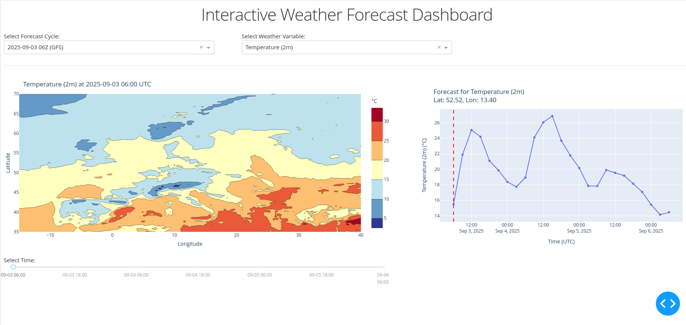

# Weather Data Pipeline

This project implements an end-to-end pipeline that downloads, processes, and visualizes operational weather forecasts from both global (GFS) and regional (MET Nordic) models. It is designed to be automated, providing actionable, time-stepped map visualizations for decision support in various industries.



## 📋 Features

- **Dual Model Ingestion**: Fetches data from the GFS global model and the MET Nordic regional model.
- **Automated Orchestration**: A scheduler runs the entire pipeline 24/7, ensuring data is always up-to-date.
- **Efficient Storage**: Processed data is stored in the cloud-native Zarr format, optimized for multi-dimensional weather data.
- **Static & Interactive Visualizations**:
    - Generates static map images for each forecast step.
    - Provides a web-based interactive dashboard for dynamic exploration of the data.
- **Key Meteorological Parameters**: Processes wind, temperature, precipitation, cloud cover, surface pressure, and wind gusts.

## 🏗️ Repository Structure

```
weather-data-pipeline/
├── config.py                 # Main configuration file (e.g., map boundaries)
├── data_ingestion/           # Scripts for downloading forecast data
├── data_processing/          # Scripts for processing raw GRIB2 files
├── doc/                      # Project documentation
├── orchestration/            # Pipeline scheduling and automation logic
├── scr/                      # Main executable scripts
│   └── run_pipeline.sh       # Master script to run all pipeline functions
├── visualization/            # Scripts for creating maps and the dashboard
│   ├── plots/                # Output directory for static map images
│   └── run_dashboard.py      # Script to launch the interactive dashboard
├── requirements.txt          # Python dependencies
└── README.md                 # This file
```

## 🚀 Getting Started

### Prerequisites
- Python 3.10+
- Linux/macOS (tested on Linux)
- `curl` and `bash` for installing `uv`.

### Installation

1.  **Clone the repository**
    ```bash
    git clone <repository-url>
    cd weather-data-pipeline
    ```

2.  **Set up the virtual environment with `uv`**
    This project uses `uv` for fast and efficient package management.

    ```bash
    # Install uv if you don't have it
    curl -LsSf https://astral.sh/uv/install.sh | sh

    # Create and activate a virtual environment
    uv venv .venv --python 3.11
    source .venv/bin/activate

    # Install the required Python dependencies
    uv pip install -r requirements.txt
    ```

3. Some of the markdown documents in the `doc` directory need
   to be rendered using quarto.

   **Install Quarto** (if not already installed)
   - Follow instructions at: https://quarto.org/docs/get-started/
   - For a loćal installation, follow: https://quarto.org/docs/download/tarball.html?version=1.7.32&idPrefix=download
   Then render the `.qmd` documents using
   `quarto render file.qmd` (for html output) 
   `quarto render file.qmd --to pdf` (for pdf output)


## ⚙️ Usage

The entire pipeline is controlled by the `scr/run_pipeline.sh` script, which offers several modes of operation.

### Running the Full Pipeline

You can run the pipeline to download and process the latest available weather data.

-   **Default Mode**: Automatically finds the most recent forecast cycle and runs the full pipeline. This is the most common command for a single run.
    ```bash
    ./scr/run_pipeline.sh default
    ```

-   **Manual Mode**: Run the pipeline for a specific historical date and forecast cycle.
    ```bash
    # Usage: ./scr/run_pipeline.sh manual --date <YYYYMMDD> --cycle <00|06|12|18>
    ./scr/run_pipeline.sh manual --date 20250903 --cycle 12
    ```

-   **Scheduler Mode**: Run the pipeline continuously in a 24/7 loop. It will process the latest data, then wait 6 hours before running again.
    ```bash
    ./scr/run_pipeline.sh scheduler
    ```

### Automating with Crontab

For a more robust automation setup, you can use `cron` to schedule the pipeline. This avoids having a process running continuously in a terminal.

1.  Open your crontab file for editing:
    ```bash
    crontab -e
    ```

2.  Add the following lines, making sure to replace `/path/to/your/project` with the absolute path to the `weather-data-pipeline` directory:
    ```cron
    # Run the weather pipeline every 6 hours, one hour after new GFS data is expected (times in UTC)
    0 1 * * * cd /path/to/your/project && ./scr/run_pipeline.sh default >> /path/to/your/project/logs/cron.log 2>&1
    0 7 * * * cd /path/to/your/project && ./scr/run_pipeline.sh default >> /path/to/your/project/logs/cron.log 2>&1
    0 13 * * * cd /path/to/your/project && ./scr/run_pipeline.sh default >> /path/to/your/project/logs/cron.log 2>&1
    0 19 * * * cd /path/to/your/project && ./scr/run_pipeline.sh default >> /path/to/your/project/logs/cron.log 2>&1
    ```
    This will run the pipeline in `default` mode at 01:00, 07:00, 13:00, and 19:00 UTC, capturing each of the four daily GFS cycles. Log output will be appended to `logs/cron.log`.

### Viewing the Results

After the pipeline has run successfully, you can view the output in two ways:

1.  **Static Maps**
    Generated `.png` map images for each forecast variable and time step are saved in the `visualization/plots/` directory, organized by date and cycle.

2.  **Interactive Dashboard**
    To explore the data dynamically, launch the web-based dashboard.

    ```bash
    ./scr/run_pipeline.sh dashboard
    ```
    Then, open your web browser and navigate to the URL shown in the terminal (usually `http://127.0.0.1:8050`).

3. **Different dashboard options**
   The default option of the interactive dashboard displays contours for all variables.
   This can make it difficult to determine where in the map we are looking at. 
   An extra scatter-based version of the display is also incuded.

   To run specific versions of the dashboard use
    ```bash
    python ./visualization/run_dashboard.py # for the standard version
    python ./visualization/run_dashboard.py --dashboard_type "scatter" # for a scatter-point based display.
    ```

## 🔧 Configuration

You can customize the pipeline's behavior by editing `config.py`. The most common setting to change is `EUROPE_BOUNDS` to adjust the geographic area of the output maps.
